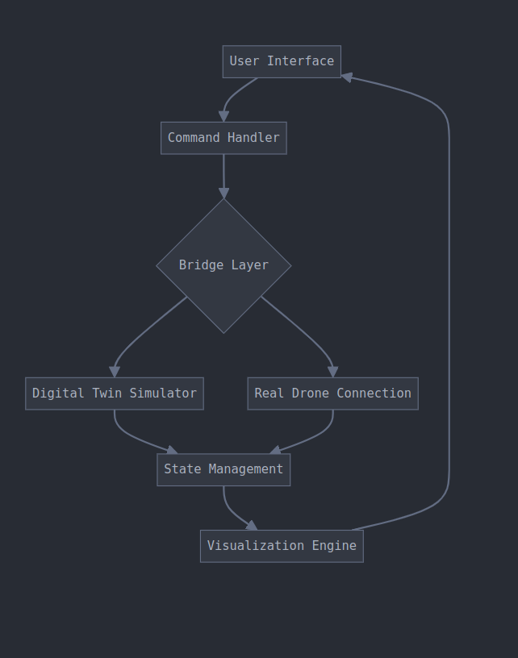

# Tello Digital Twin Dashboard

A comprehensive digital twin implementation for the DJI Tello drone, featuring bidirectional communication between the physical drone and its digital counterpart.


## Overview

This project implements a digital twin system for the DJI Tello drone, providing real-time synchronization between a physical drone and its virtual representation. The system includes a web-based dashboard for control and monitoring, state visualization, and bidirectional command handling.

## Architecture

The system follows a layered architecture that enables seamless integration between the physical drone and its digital representation:



### Key Components

- **Command Handler**: Processes and validates user inputs
- **Bridge Layer**: Manages communication between physical and virtual components
- **State Management**: Synchronizes states between physical and digital twins
- **Visualization Engine**: Provides real-time 3D visualization and metrics

## Features

- Real-time 3D visualization of drone position and orientation
- Bidirectional state synchronization
- Interactive control panel for drone operations
- Live telemetry data display
- Battery and height monitoring
- Emergency controls and safety features

## Getting Started

### Prerequisites

- Python 3.10 or newer
- DJI Tello drone (for physical drone operations)
- Linux/macOS/Windows operating system

### Installation

1. Clone the repository:
```bash
git clone https://github.com/miladnasiri/Tello-Digital-Twin-Dashboard.git
cd Tello-Digital-Twin-Dashboard
```

2. Create and activate virtual environment:
```bash
python3 -m venv venv
source venv/bin/activate  # On Windows: venv\Scripts\activate
```

3. Install dependencies:
```bash
pip install -r requirements.txt
```

### Running the Application

1. Start the dashboard:
```bash
streamlit run app.py
```

2. Access the dashboard at `http://localhost:8501`

## Project Structure

```
tello-digital-twin/
.
├── analysis
│   ├── __init__.py
│   ├── __pycache__
│   └── state_analyzer.py
├── app.py
├── config
│   ├── __init__.py
│   ├── __pycache__
│   └── tello_specs.py
├── handlers
│   ├── drone_monitor.py
│   ├── __init__.py
│   ├── patterns.py
│   ├── __pycache__
│   └── simulation_handler.py
├── image
│   ├── flwchart.png
│   └── webinterface.png
├── mock_data
│   ├── __init__.py
│   ├── __pycache__
│   └── states.py
├── README.md
├── requirements.txt
├── utils
│   ├── __init__.py
│   ├── __pycache__
│   └── visualizer.py

```

## Communication Modes

### Simulation Mode
- Virtual drone operation
- State simulation
- No physical drone required

### Connected Mode
- Bidirectional communication with physical drone
- Real-time state synchronization
- Command validation and error handling

## System Architecture

The system implements a bridge pattern for handling communication:

```python
Digital Twin ←→ Bridge Layer ←→ Physical Drone
```

- **State Synchronization**: Automatic sync between physical and digital states
- **Command Validation**: Pre-execution validation of all commands
- **Error Handling**: Robust error management for connection issues

## Contributing

1. Fork the repository
2. Create your feature branch (`git checkout -b feature/AmazingFeature`)
3. Commit your changes (`git commit -m 'Add some AmazingFeature'`)
4. Push to the branch (`git push origin feature/AmazingFeature`)
5. Open a Pull Request

## License

This project is licensed under the MIT License - see the [LICENSE](LICENSE) file for details.

## Acknowledgments

- DJI Tello SDK documentation
- Streamlit community
- Plotly for visualization components

## Contact

Milad Nasiri - [@LinkedIn.com](https://www.linkedin.com/in/miladnasiri/)
Project Link: [https://github.com/miladnasiri/TelloDigital-Twin-Dashboard](https://github.com/miladnasiri/TelloDigital-Twin-Dashboard)
